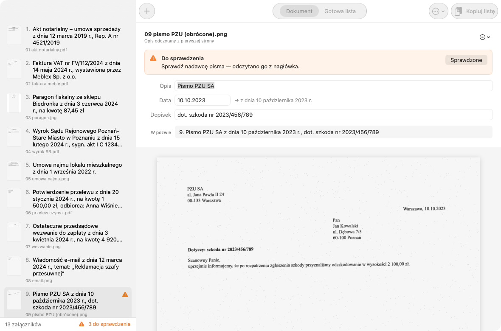
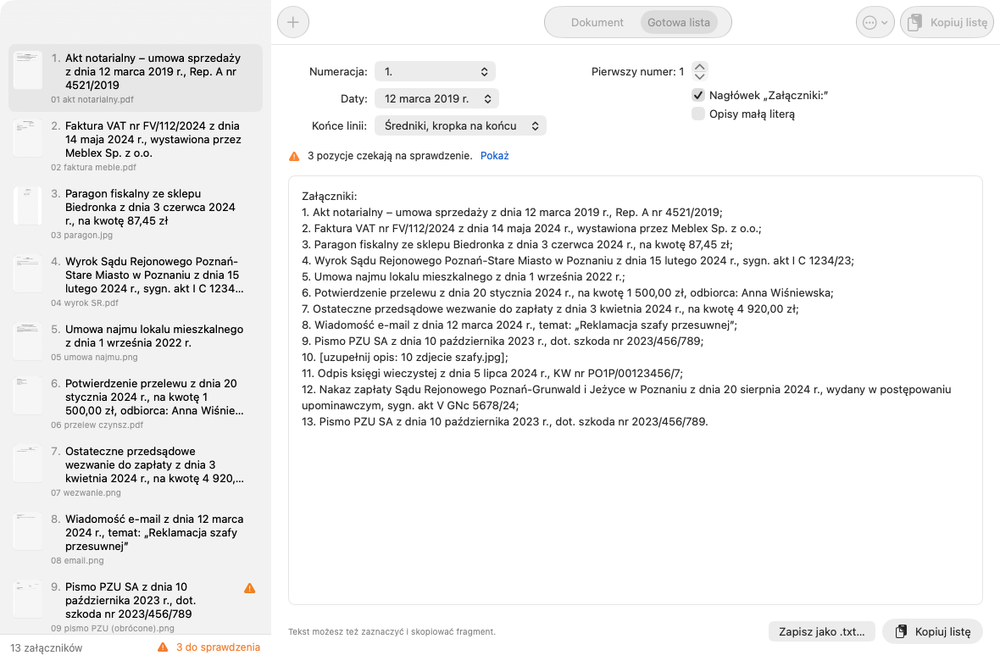

# Załączniki

**Lista załączników do pozwu w kilka sekund zamiast kilkudziesięciu minut przepisywania.**

Natywna aplikacja macOS dla kancelarii adwokackiej. Przeciągasz na okno skany dokumentów, które mają być
załącznikami — program odczytuje pierwszą stronę każdego z nich, rozpoznaje rodzaj dokumentu, datę
i najważniejsze oznaczenia, a potem składa gotową, numerowaną listę do wklejenia w pozew:

```
Załączniki:
1. Akt notarialny – umowa sprzedaży z dnia 12 marca 2019 r., Rep. A nr 4521/2019;
2. Faktura VAT nr FV/112/2024 z dnia 14 maja 2024 r., wystawiona przez Meblex Sp. z o.o.;
3. Paragon fiskalny ze sklepu Biedronka z dnia 3 czerwca 2024 r., na kwotę 87,45 zł;
4. Wyrok Sądu Rejonowego Poznań-Stare Miasto w Poznaniu z dnia 15 lutego 2024 r., sygn. akt I C 1234/23;
5. Nakaz zapłaty Sądu Rejonowego Poznań-Grunwald i Jeżyce w Poznaniu z dnia 20 sierpnia 2024 r., wydany w postępowaniu upominawczym, sygn. akt V GNc 5678/24.
```



## Co potrafi

- **Rozpoznaje typowe dokumenty** — akty notarialne (z numerem repertorium i rodzajem czynności), faktury
  (numer, sprzedawca), paragony (sklep, kwota), wyroki, postanowienia i nakazy zapłaty (sąd w dopełniaczu,
  sygnatura), umowy i aneksy, potwierdzenia przelewów, wezwania do zapłaty, odpisy KRS i ksiąg wieczystych,
  odpisy aktów stanu cywilnego, e-maile, pisma i kilkadziesiąt innych nagłówków.
- **Wybiera właściwą datę** — datę wystawienia albo sporządzenia, a nie datę urodzenia, termin płatności
  czy datę ustawy przywołanej w treści.
- **Uczciwie mówi, czego nie wie** — pozycje, których nie jest pewien, oznacza pomarańczowym trójkątem
  z konkretnym powodem („Nie odczytano nazwy sklepu", „Na stronie jest kilka dat"). ⌘G przeskakuje do następnej.
- **Łatwa edycja** — opis, data i dopisek to zwykłe pola; datę można wpisać dowolnie („12.3.2019",
  „12 marca 2019"), a na bieżąco widać, jak pozycja będzie wyglądać w pozwie.
- **Format listy do wyboru** — „1." / „1)" / „Załącznik nr 1 –", daty słownie albo cyfrowo, średniki,
  numer początkowy (gdy lista jest dalszym ciągiem), nagłówek, opisy małą literą.
- **Kopiuj albo zapisz** — jednym kliknięciem do schowka (⇧⌘C) albo do pliku `.txt`.
- **Porządek** — kolejność według nazw plików, przeciąganie, sortowanie po dacie dokumentu;
  wybór innej strony, gdy pierwsza jest okładką; skany zeskanowane bokiem są obracane automatycznie.



## Prywatność

Domyślnie **wszystko dzieje się na komputerze** — tekst odczytuje wbudowany w macOS silnik Apple Vision,
a rozpoznawanie to lokalne reguły. Skany nie opuszczają dysku.

Opcjonalnie, w Ustawieniach (⌘,), można włączyć opis trudnych dokumentów przez model Claude (Anthropic) —
wtedy obraz pierwszej strony i odczytany tekst trafiają do API. Tryb jest domyślnie wyłączony, bo decyzja
należy do adwokata w konkretnej sprawie. Klucz API jest przechowywany w pęku kluczy macOS.

## Wymagania

- macOS 12.3 Monterey lub nowszy
- Intel albo Apple Silicon (jeden plik universal)
- Na macOS 12–14 Apple Vision nie ma polskiego słownika — program jest na to przygotowany
  (reguły ignorują ogonki, a znane słowa i nazwy miast odzyskują polskie znaki).

## Instalacja

Pobierz `Zalaczniki-x.y.z.zip`, rozpakuj i przeciągnij **Załączniki** do Programów. Aplikacja jest
podpisana certyfikatem Developer ID i znotaryzowana przez Apple.

## Budowa

Wystarczą Command Line Tools (bez Xcode, bez zależności):

```
./scripts/build.sh              # build/Załączniki.app (universal) + ZIP, podpis Developer ID
./scripts/build.sh --notaryzuj  # dodatkowo notaryzacja (profil notarytool „zalaczniki")
```

Profil notaryzacji zakłada się raz:
`xcrun notarytool store-credentials zalaczniki --apple-id … --team-id …` (hasło do aplikacji z account.apple.com).

## Testy rozpoznawania

```
swift tests/MakeSamples.swift tests/samples      # syntetyczne skany polskich dokumentów (dane zmyślone)
swiftc -O -swift-version 5 -runtime-compatibility-version none -target arm64-apple-macos12.3 \
  Sources/Core/*.swift tests/Probe.swift -o build/probe
./build/probe tests/samples/*                    # propozycje opisów + gotowa lista
ZAL_OCR_REVISION=2 ZAL_STRIP_PL=1 ./build/probe tests/samples/*   # symulacja OCR z macOS 12
```

`tests/Snapshot.swift` renderuje prawdziwe widoki aplikacji do PNG (jasny i ciemny motyw).

## Struktura

```
Sources/Core/   OCR (Vision, czytanie w pasach), klasyfikator dokumentów, daty, formatowanie listy, klient Claude
Sources/App/    interfejs SwiftUI: lista, edycja pozycji, gotowa lista, ustawienia
scripts/        build.sh (universal + podpis + notaryzacja), Ikona.swift
tests/          generator skanów, sonda rozpoznawania, zrzuty interfejsu
```

## Licencja

[MIT](LICENSE) © 2026 Przemysław Plewiński. Program nie jest poradą prawną — opisy załączników
zawsze warto przejrzeć przed złożeniem pisma.

## Uwagi techniczne

- Narzędzia z macOS 27 nie mają bibliotek zgodności Swift dla Intela → minimum 12.3 i
  `-runtime-compatibility-version none` (runtime 5.6 jest w systemie od 12.3).
- `@State` jest w SDK macOS 27 makrem dostępnym tylko z Xcode → w kodzie `State(initialValue:)` wprost.
- Vision na całej, zaszumionej stronie potrafi „zawisnąć" na minutę i nic nie zwrócić —
  dlatego strona jest czytana w trzech zachodzących na siebie pasach (0,2 s na dokument).
